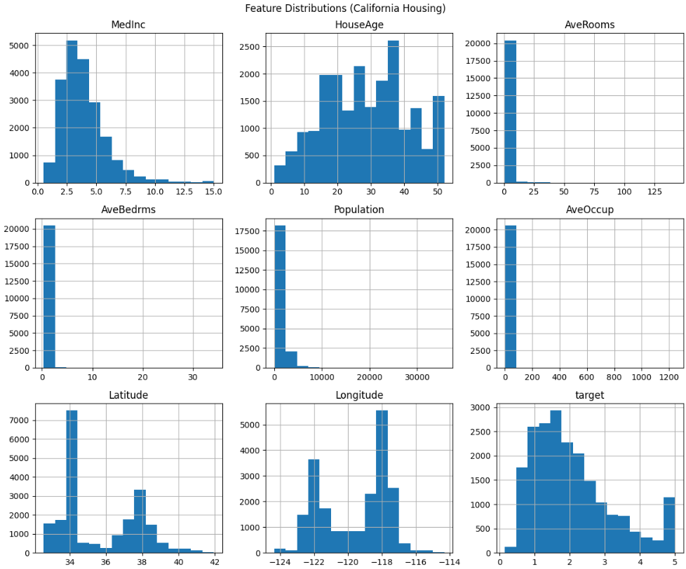
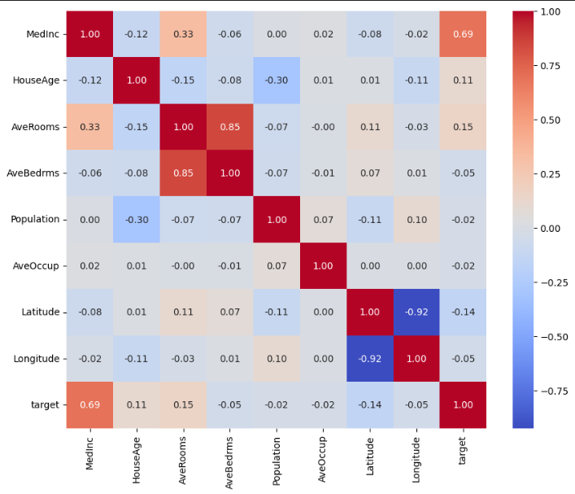
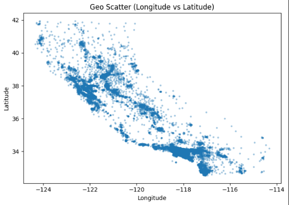

---

## 1. 📊 Data Preprocessing & Exploratory Data Analysis (EDA)

The goal of this phase was to:
- Understand feature distributions  
- Detect skewness and outliers  
- Identify multicollinearity  
- Engineer meaningful features  
- Prepare data for robust and interpretable modelling  

---

## 📁 Data Overview

Each row in the dataset represents a **California census block group**.

### Input Features
- `MedInc` – Median income (in $10,000)  
- `HouseAge` – Median house age (years)  
- `AveRooms` – Average number of rooms per household  
- `AveBedrms` – Average number of bedrooms per household  
- `Population` – Population of the block group  
- `AveOccup` – Average household occupancy  
- `Latitude` – Geographic latitude  
- `Longitude` – Geographic longitude  

### Target Variable
- `MedHouseValue` – Median house value (in $100,000)

---

## 📈 Feature Distribution Analysis (Histograms)

Histograms were generated to understand how each feature is distributed.

### Histograms

### Why histograms were used
Histograms helped identify:
- Skewness (left or right)  
- Presence of outliers  
- Artificial caps or truncation  
- Engineered or ratio-based features  

### Key Observation
Most features exhibit **right-skewed distributions**, particularly `MedInc`, `Population`, `AveRooms`, and `AveOccup`, indicating the presence of outliers and motivating feature scaling. `HouseAge` shows a clear upper cap around 52 years, reflecting a dataset constraint rather than a natural boundary. Several features are engineered ratios, which informed later preprocessing and feature selection decisions.

---

## 🔗 Correlation Analysis & Multicollinearity

A correlation heatmap was generated to identify linear dependencies between features.

### Correlation Heatmap

### Why correlation analysis was performed
Highly correlated features can:
- Introduce redundancy  
- Increase variance in linear models  
- Reduce interpretability  
- Add unnecessary complexity  

Correlation analysis was performed only on input features, excluding the target variable.

### Key Observations
- `AveRooms` and `AveBedrms` showed strong positive correlation, indicating redundant information.  
- `AveBedrms` was removed during preprocessing, as `AveRooms` provides broader explanatory power.  
- `Latitude` and `Longitude` exhibited strong negative correlation; however, both were retained as they encode distinct spatial dimensions essential for geographic modelling.  

---

## 🌍 Geographic Visualization

A scatter plot of longitude versus latitude was generated to visualize spatial distribution.

### Scatter Plot

### Insights
- Clear diagonal structure reflecting California’s geography  
- Dense clusters around major urban areas  
- Confirms that spatial features are meaningful predictors  

This visualization highlighted that housing prices are influenced by **regional patterns rather than isolated coordinates**, motivating further geographic feature engineering.

---

## 🗺️ Geographic Feature Engineering (Clustering)

Although latitude and longitude are informative, they are not intuitive inputs for end users. To address this, an **unsupervised clustering approach** was applied to group geographic coordinates into meaningful regions.

A K-Means clustering algorithm was trained using latitude and longitude values to identify natural spatial groupings within California. Each census block group was assigned to a geographic cluster, representing a region with similar spatial characteristics.

This approach:
- Preserves geographic information relevant to housing prices  
- Reduces reliance on raw coordinates  
- Improves interpretability and usability in the deployed application  

The resulting cluster label was used as an engineered feature during model training.

---

## ✅ Final Feature Selection

After preprocessing, correlation-based filtering, and geographic feature engineering, the final feature set used for model training is:

- `MedInc`  
- `HouseAge`  
- `AveRooms`  
- `Population`  
- `AveOccup`  
- `GeoCluster`  

---

## 2. 🤖 Model Training, Testing, and Evaluation

After completing data preprocessing and feature engineering, an **XGBoost regression model** was trained to predict median house prices. XGBoost was selected due to its strong performance on structured tabular data, ability to capture non-linear relationships, and built-in regularization mechanisms.

---

### ⚙️ Model Selection: Why XGBoost?

XGBoost (Extreme Gradient Boosting) was chosen for the following reasons:
- Excellent performance on tabular datasets  
- Ability to model complex, non-linear feature interactions  
- Robustness to skewed feature distributions and outliers  
- Built-in regularization to reduce overfitting  
- Efficient training on moderately large datasets  

---

### 🧪 Train-Test Split

The dataset was split into training and testing sets:
- **Training set:** 80%  
- **Testing set:** 20%  
- **Random state:** 42  

Only the selected features from the preprocessing phase were used during training.

---

### 🧠 Model Training

The XGBoost regressor was trained using a fixed set of hyperparameters designed to balance bias and variance, ensuring effective generalization to unseen data.

---

### 📐 Evaluation Metrics

Model performance was evaluated using:
- **Mean Absolute Error (MAE)**  
- **Root Mean Squared Error (RMSE)**  
- **R² Score**  

All metrics were reported in real-world dollar values for interpretability.

---

### 📊 Model Performance Summary

The trained XGBoost model demonstrated strong predictive performance, achieving low prediction error relative to the target scale and stable generalization on unseen test data.

---

## 3. 🧩 Application Development

The trained model was integrated into a **Django web application** to provide an end-to-end prediction system.

---

### 🖥️ Application Architecture

The application follows the **Model–View–Template (MVT)** architecture:
- **Model layer:** Stores the trained XGBoost model and preprocessing logic  
- **View layer:** Handles user input, validation, preprocessing, and prediction  
- **Template layer:** Provides a user-friendly interface  

---

### ✍️ User Input Handling

To improve usability:
- Users are not required to input latitude or longitude directly  
- Geographic regions are selected via clustered location groups  
- Inputs are provided in human-friendly units  

Backend preprocessing ensures consistency between training and inference.

---

### 🔄 Prediction Pipeline

1. User submits input through a web form  
2. Inputs are validated and preprocessed  
3. The trained XGBoost model generates a prediction  
4. The predicted house price is returned in real-world currency  

---

### 🎯 Project Outcome

The final application demonstrates:
- A complete machine learning pipeline from analysis to deployment  
- Justified preprocessing and feature engineering decisions  
- A performant and interpretable predictive model  
- A practical, user-friendly interface  

---
